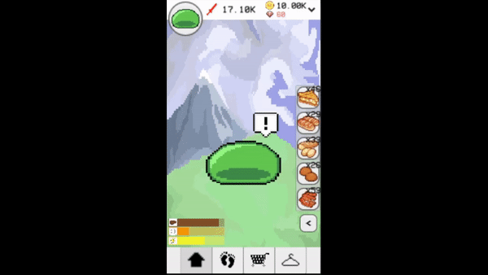
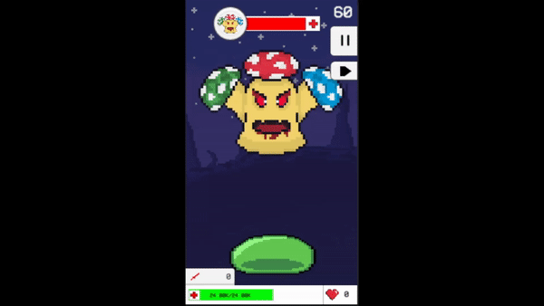
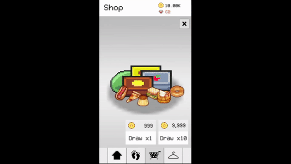

   <h1>
    Idle RPG Slime Adventure
  </h1>
  
  
A Game made for educational purpose.

  

## 🤔 Getting Started

Follow the below instructions to get started:

1. [Make sure you have all Requirements](#requirements)
2. [Download Source Code](#download)
3. Open Project in Unity and Enjoy!

## ⚙️ Requirements

Make sure you have the requirements before starting:

- [Unity Game Engine](https://unity3d.com)
- Basic Knowledge about Unity and C#

## ⬇️ Download

[:sparkles: Download Source Code](https://github.com/raxelf/WildWestern-Duel-Game-Prototype/archive/refs/heads/main.zip)

## 📹 Previews

   <h3>
      Adventure Mode
   </h3>
   
   <h3>
      Endless Mode
   </h3>
  
  <h3>
      World Boss Fight
   </h3>
  
  <h3>
      Evolve
   </h3>
  
  <h3>
      Gacha
   </h3>
  
   <h3>
      Food Description
   </h3>
  

## 🧑‍💻 Teams

- @ [YosuaEvan](https://github.com/yosuaevan/)
- @ [raxelf](https://github.com/raxelf/)
